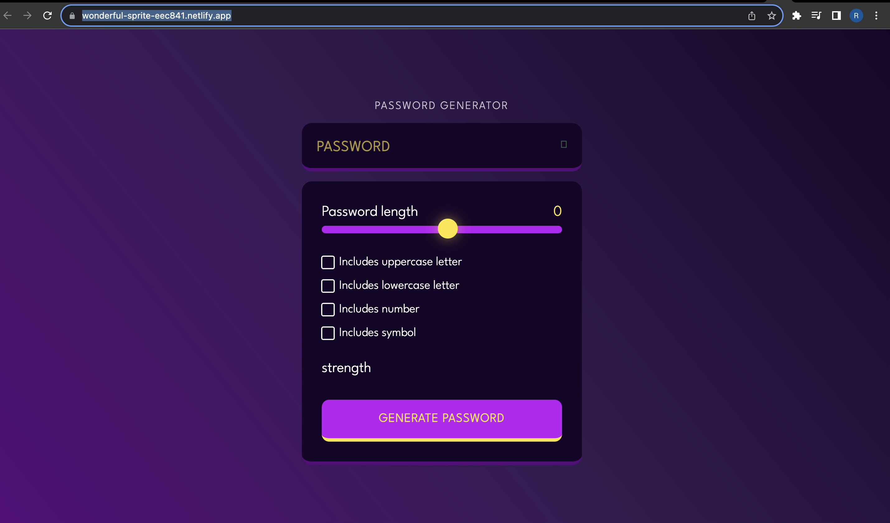

# Password Generator

## Overview

The Password Generator is a web application that allows you to create strong, random passwords based on your preferences. It is designed to be easy to use and customizable according to your specific needs.

## Features

- Generate random passwords with various options.
- Customize password length.
- Include or exclude uppercase letters, lowercase letters, numbers, and symbols.
- See the strength of the generated password.
- Copy the generated password to the clipboard.

## Usage

1. Visit the live application: [Password Generator](https://wonderful-sprite-eec841.netlify.app/)
2. Adjust the settings as needed:
   - Slide the "Password length" slider.
   - Select the checkboxes for the character types you want to include.
3. The generated password will be displayed in the "password" field.
4. Click the "Copy" button to copy the password to your clipboard.
5. Optionally, adjust the settings and generate a new password.

## Technologies Used

- HTML
- CSS (with some tailwind CSS classes)
- JavaScript

/
# Password-generator